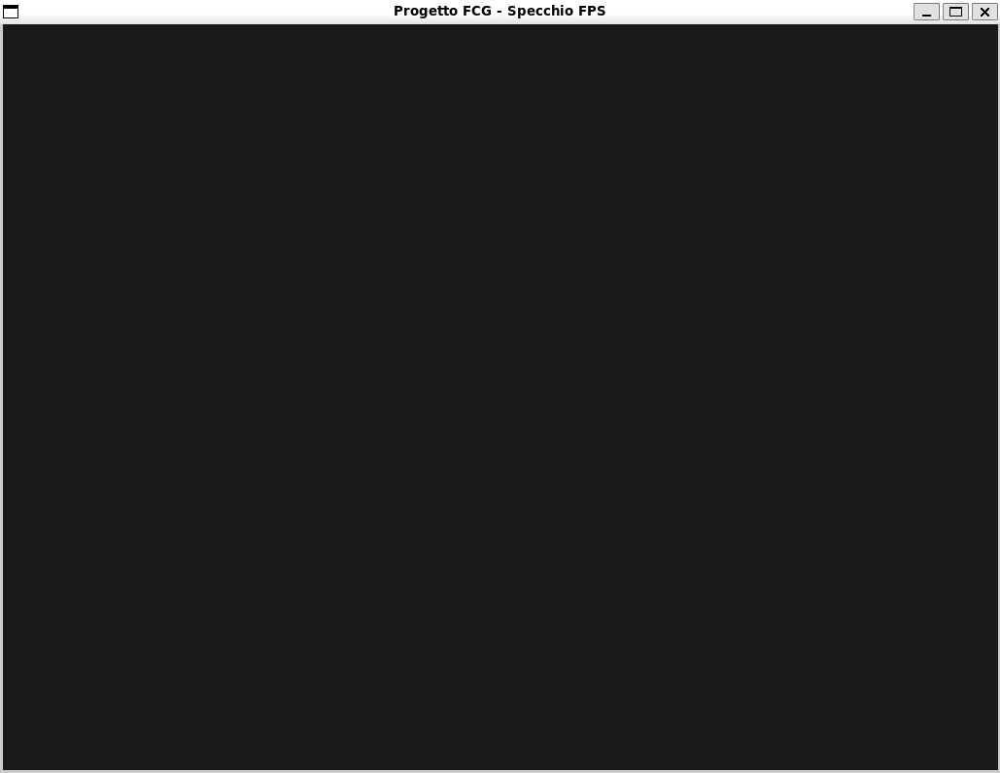
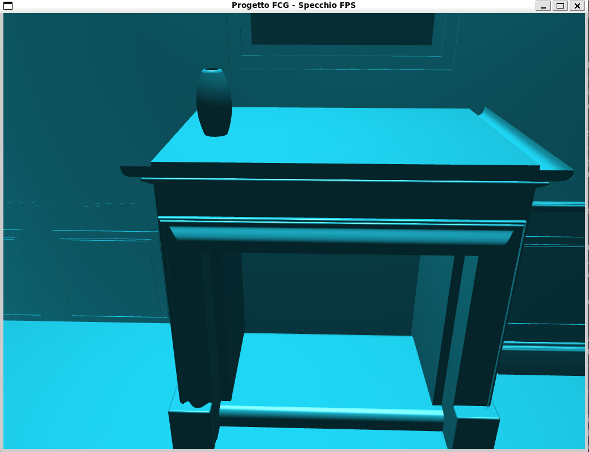
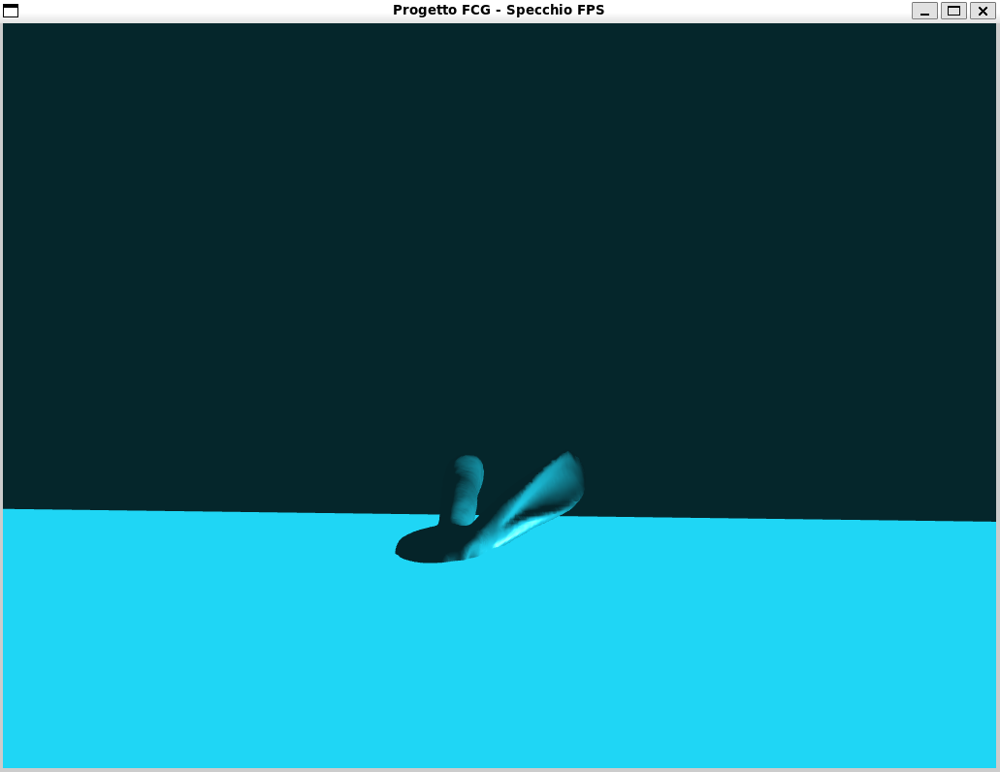
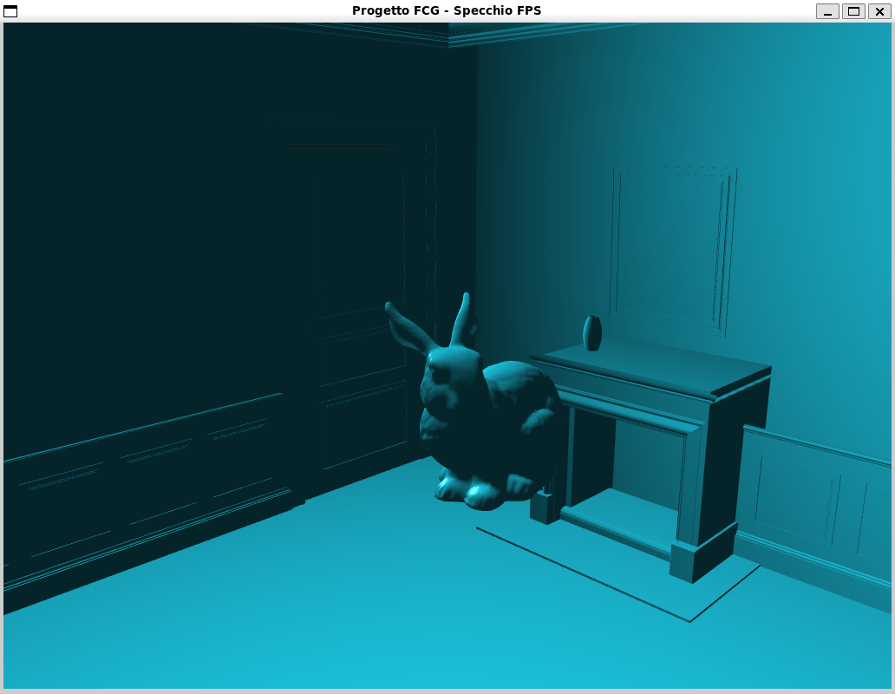
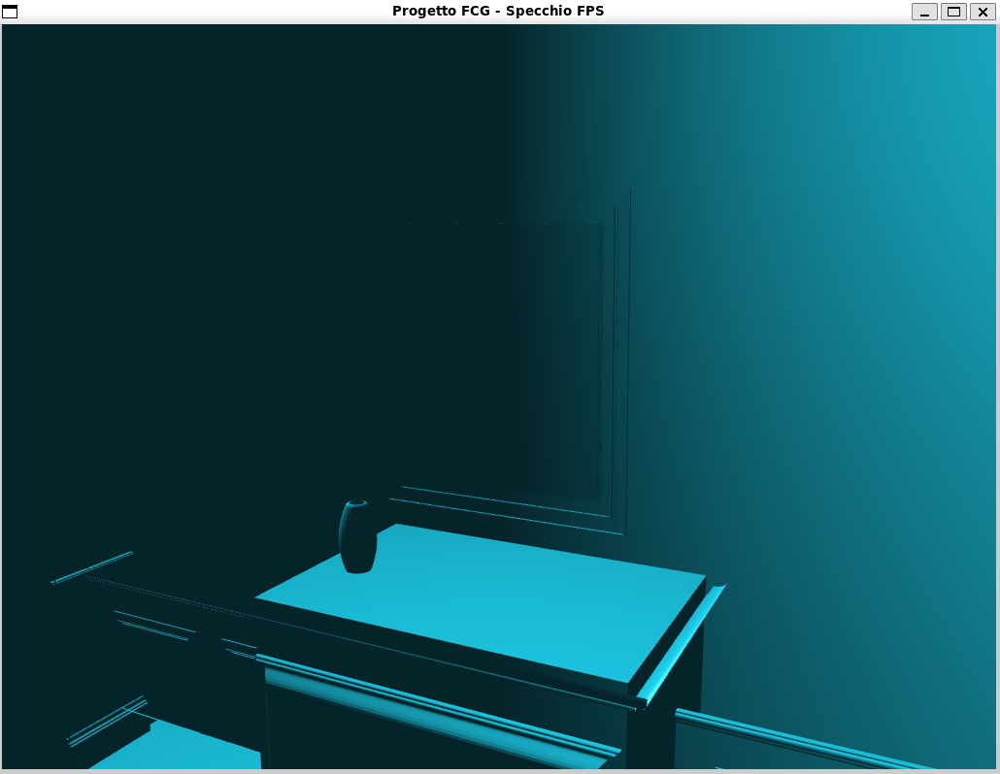
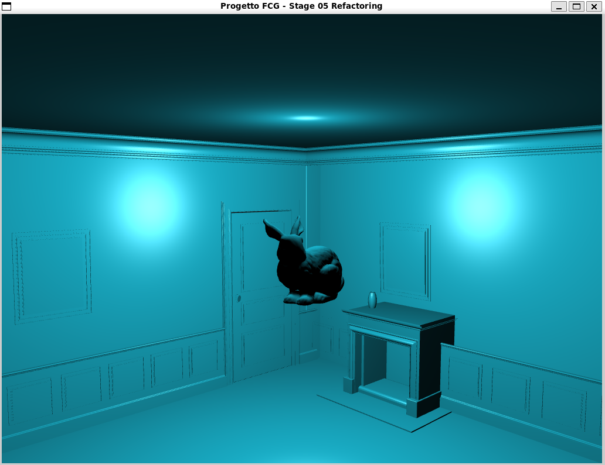
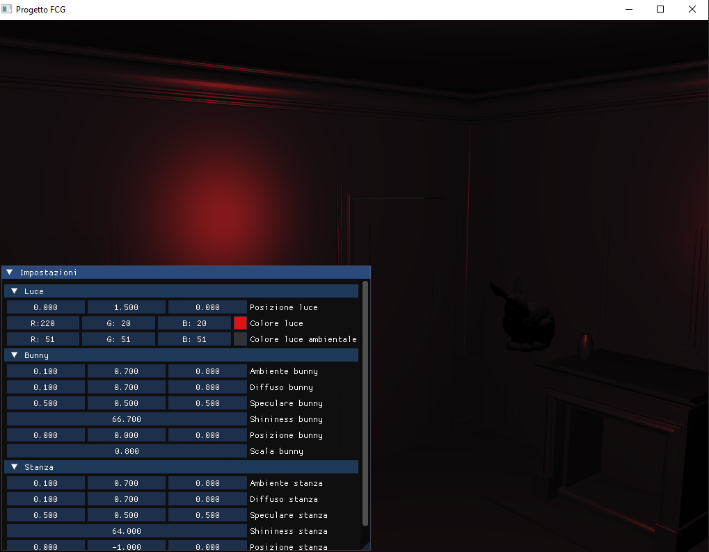
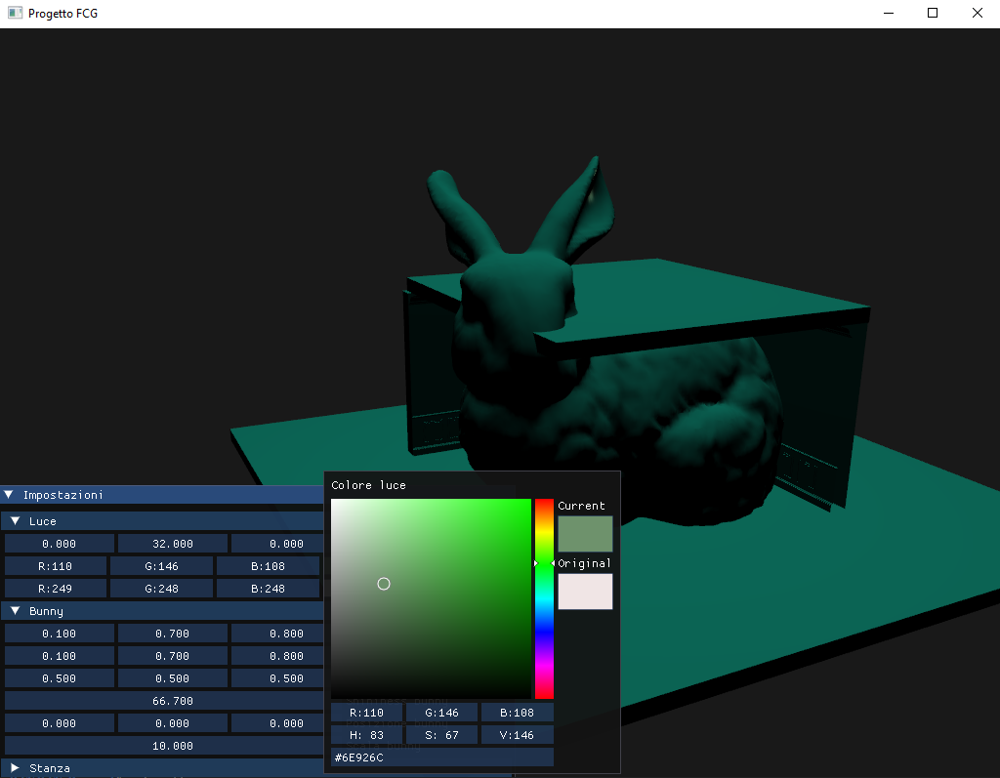
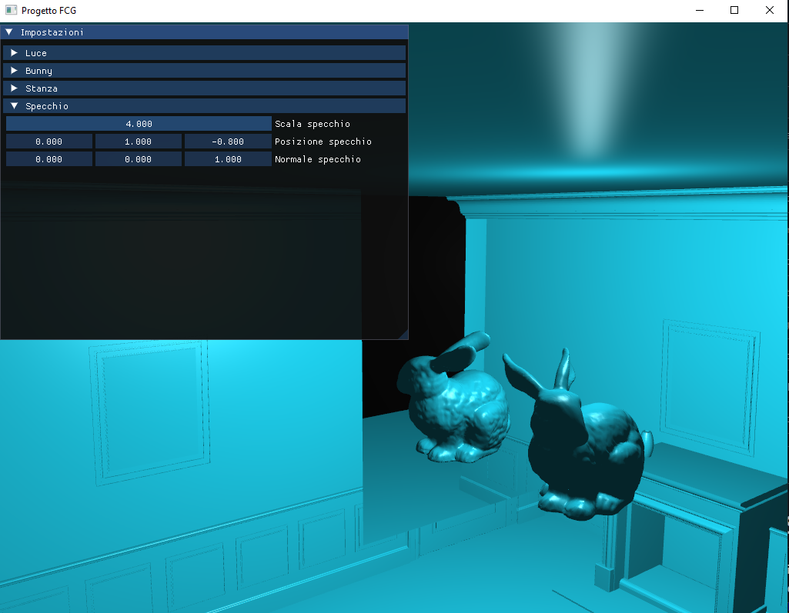
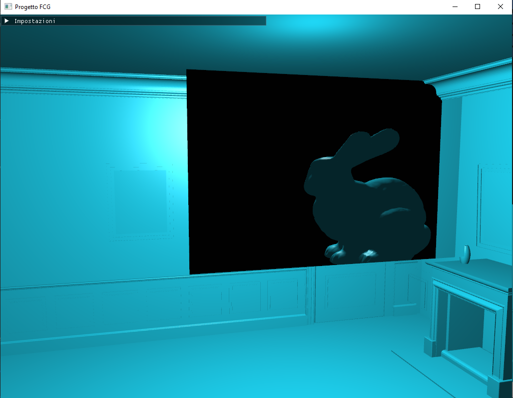

# Relazione di Progetto: Simulazione Specchio 3D
## Fondamenti di Computer Grafica

### Obiettivo del Progetto
Il progetto si propone di realizzare un'applicazione grafica 3D in tempo reale utilizzando C++17 e le librerie OpenGL (4.1), SFML e GLM. L'obiettivo primario è l'implementazione di un effetto specchio planare realistico situato all'interno di un ambiente chiuso (una stanza). L'effetto di riflessione dinamica sarà ottenuto manipolando lo **Stencil Buffer** di OpenGL.

Per permettere all'utente di osservare i cambiamenti prospettici del riflesso da diverse angolazioni, la navigazione dell'ambiente avverrà tramite l'implementazione di una telecamera in prima persona esplorabile con mouse e tastiera. Inoltre, il progetto integra la libreria **ImGui** per fornire un'interfaccia grafica intuitiva (GUI) utile alla gestione e al debugging in tempo reale dei parametri di scena.

---

### Sviluppo a Tappe
Lo sviluppo del progetto segue un flusso di lavoro incrementale e modulare ("Stages"), gestito tramite tag di Git e uno script Bash per la compilazione simultanea delle varie tappe storiche.

#### Stage 01: Template e Inizializzazione Base
L'obiettivo di questa prima fase è stato predisporre un ambiente di sviluppo solido, prendendo spunto dalle fondamenta architetturali di progetti precedenti.

* **Cosa aggiunge:** È stato configurato un template di base che predispone l'infrastruttura del progetto. Al momento viene visualizzata esclusivamente una finestra con uno **sfondo grigio neutrale**, senza alcuna geometria (nessun pavimento) o pannello GUI renderizzato. L'obiettivo è confermare la corretta compilazione e l'inizializzazione del contesto OpenGL.

#### Stage 02: Modularizzazione e Telecamera FPS
In questa fase il monolite iniziale è stato scomposto in moduli indipendenti e scalabili (Camera, Scene, Lights, Materials e Shaders). 

* **Cosa aggiunge:** È stata progettata e integrata una telecamera in prima persona (FPS) fluida, basata sul *delta time*, esplorabile tramite tastiera (WASD) e rotazione drag-and-drop del mouse, garantendo così una perfetta compatibilità e reattività anche su ambiente macOS. Il `main` è diventato un "direttore d'orchestra" pulito, strutturato per ospitare e renderizzare le geometrie esterne in modo ordinato.

#### Stage 03: Geometrie OFF, Illuminazione e Problemi di Scala
In questa fase l'infrastruttura è stata estesa per supportare il caricamento di modelli 3D complessi da file esterni e il calcolo realistico dell'illuminazione diffusa e speculare.

* **Cosa aggiunge:** È stata implementata la classe `Mesh` per il parsing dei file testuali `.off`, integrando l'algoritmo di calcolo delle normali per vertice (*Smooth Shading*) ereditato dalla logica originale del docente per rendere le superfici morbide alla luce. L'architettura è stata ottimizzata unificando la gestione di luci e materiali nella classe `Lighting` e delegando la matematica complessa e la gestione degli input hardware a funzioni helper esterne al `main`.
* **Stato attuale e Problematiche Spaziali:** Dal punto di vista del codice, il sistema compila ed esegue correttamente tutti i passaggi di rendering e shading. Tuttavia, l'applicazione grezza delle matrici di trasformazione (`glm::scale` e `glm::translate`) evidenzia notevoli problemi di scala e di posizionamento spaziale dovuti alle proporzioni intrinseche dei file caricati. Il modello della stanza (`corner.off`) presenta coordinate enormi e risulta eccessivamente fuori scala rispetto alla telecamera, impedendo di inquadrarlo interamente. Al contempo, il modello del coniglio (`bunny.off`) e la sorgente luminosa risentono di disallineamenti spaziali nel posizionamento manuale, finendo bloccati e compenetrati all'interno della geometria stessa delle pareti della stanza.

#### Stage 04: Normalizzazione Spaziale e Bounding Box
In questa fase, l'obiettivo principale è stato risolvere le pesanti discrepanze di scala e posizionamento dei modelli 3D importati, come evidenziato nello stage precedente.

* **Algoritmo di Normalizzazione:** È stato implementato un sistema automatico di *Bounding Box Normalization* direttamente all'interno della classe costruttrice `Mesh`. Durante il parsing, il sistema scandisce i vertici per trovare le coordinate minime e massime ("scatola di ingombro"), calcolandone il baricentro e il lato di massima estensione. Tutti i vertici vengono quindi sottratti al centro e divisi per l'estensione massima: il risultato è un modello perfettamente centrato nell'origine spaziale `(0,0,0)` e ridotto a una dimensione unitaria (es. 1x1x1), senza subire deformazioni proporzionali.
* **Ottimizzazione Architetturale (Pre-calcolo):** Con i modelli finalmente standardizzati, le trasformazioni geometriche spaziali (`glm::scale` e `glm::translate`) hanno acquisito un comportamento matematico prevedibile. Per massimizzare le performance del motore grafico, le Matrici di Modello (`model_matrix`) vengono ora pre-calcolate una singola volta all'esterno del *main loop*. Questa scelta evita alla CPU di rieseguire inutilmente complesse moltiplicazioni matriciali ad ogni frame per oggetti statici.

* **Stato Attuale e Bug Noti:** Gli oggetti sono ora in perfetta scala spaziale (con la stanza ingrandita a 30 unità e l'oggetto di test coerentemente poggiato al centro del pavimento). Il problema della compenetrazione è risolto, tuttavia persiste una problematica sul calcolo dell'illuminazione (probabilmente legata alla mancata normalizzazione dei vettori luce post-scalatura) che è stata isolata e schedulata per le successive sessioni di debug.

#### Stage 05: Refactoring Architetturale e Shading Avanzato

In questo stage l'obiettivo primario è stato risolvere definitivamente gli artefatti visivi ereditati dalle fasi precedenti e consolidare un'architettura software solida e priva di bug logici prima di procedere con gli effetti grafici avanzati.

* **Refactoring:** La comunicazione tra CPU e GPU (invio delle matrici `Uniform`) è stata fortemente incapsulata nelle classi competenti, rendendo il `main` unicamente responsabile della logica di alto livello.
* **Allineamento dell'Illuminazione:** Il bug delle superfici oscurate (come il soffitto nero) è stato corretto posizionando coerentemente la sorgente luminosa all'interno della geometria della stanza, assecondando le nuove dimensioni acquisite dopo i passaggi di normalizzazione e scalatura applicati nello Stage 04.
* **Risoluzione Artefatti di Shading:**
  * **Superfici Curve:** Il modello del coniglio durante lo sviluppo di questo passo ha estese corruzioni visive a causa di micro-triangoli degeneri che facevano fallire i calcoli matematici delle normali. Il problema è stato risolto implementando le **Area-Weighted Normals**, un algoritmo che calcola l'illuminazione pesando l'influenza di ciascun poligono in base alla sua area reale, producendo una superficie morbida e priva di imperfezioni.
  * **Superfici Architetturali:** L'algoritmo di smoothing tendeva a smussare erroneamente e fondere visivamente spigoli a 90° che sarebbero dovuti rimanere netti (come i muri o il camino della stanza) causando errori nella visualizazione della luce. È stato introdotto un sistema di switch per abilitare il **Flat Shading** sulle geometrie rigide, duplicando i vertici sugli angoli e garantendo la preservazione degli spigoli vivi.
* **Stato Attuale:** Il motore grafico è ora matematicamente stabile. Le ombre, le proporzioni e le risposte alla luce dei diversi tipi di superficie (organica e rigida) sono calcolate correttamente e in tempo reale. L'infrastruttura è pronta per ospitare le operazioni su Stencil Buffer nel prossimo stage.

* **Le Sfide Architetturali**
Durante questo stage, l'ostacolo più importante non è stato prettamente visivo o matematico, ma architetturale, legato al refactoring estremo del codice:

* **Ricostruzione della classe Mesh:** Scardinare le vecchie fondamenta del parsing per riscrivere un'infrastruttura capace di elaborare *Area-Weighted Normals* e gestire le risorse GPU in sicurezza ha richiesto uno sforzo notevole. È stato necessario abbattere e ricostruire l'intero ponte tra i dati su disco e la memoria video, gestendo la corruzione da micro-poligoni e riallineando un'enorme quantità di codice.
* **Migrazione della logica di basso livello:** L'intento di svuotare il `main` dalle responsabilità di calcolo (es. moltiplicazione delle matrici View-Projection o binding degli Shader) per incapsularle in `Camera`, `Scene` e `Lighting` ha innescato un "effetto domino". Spostare una singola direttiva OpenGL rompeva la delicata sincronia dei dati GPU, costringendoci a complesse sessioni di tracciamento per ripristinare il corretto flusso della pipeline grafica.

#### Stage 06: Architettura Cross-Platform, Toolchain e Input mouse stile FPS

Il lavoro svolto in questo stage si è concentrato su due macro-obiettivi fondamentali per la scalabilità del progetto: l'ingegnerizzazione del sistema di build e il miglioramento dell'interazione utente all'interno dell'ambiente 3D.

**Sistema di Build e Cross-Compilazione Sicura**
Per garantire che il motore grafico possa essere compilato e distribuito in modo riproducibile su sistemi operativi diversi, l'intera pipeline di build è stata riscritta utilizzando uno standard moderno di **CMake (C++20)**.
* Sono state redatte toolchain specifiche (es. `windows-toolchain.cmake` e `macos-toolchain.cmake`) per permettere la cross-compilazione sicura da ambiente Linux. 
* *Risoluzione criticità tecniche:* È stata affrontata e risolta una problematica architetturale intrinseca a *MinGW-w64* riguardante la gestione concorrente (multithreading). Il backend interno di SFML 3.0 richiede il pieno supporto allo standard `<mutex>` del C++ moderno per la gestione dei contesti WGL/OpenGL; per superare la limitazione del modello di threading nativo di Windows, la toolchain è stata forzata a utilizzare la variante del compilatore basata su **POSIX** (`-posix`), garantendo memory-safety e stabilità senza alterare il codice sorgente della libreria.

**Refactoring dell'Input della Camera (FPS Style)**
A livello applicativo, la navigazione della scena 3D è stata rivista per offrire un'esperienza fluida e immersiva. Si è abbandonato il vincolo del "click-to-look" (pressione continua del tasto del mouse) in favore di un sistema a cursore catturato (Pointer Lock / Cursor Grabbing). Il movimento raw del mouse viene ora intercettato costantemente per aggiornare i vettori di direzione della telecamera, disaccoppiando l'interfaccia utente (ImGui, per ora assente) dal viewport 3D in pieno stile *First-Person Shooter*.

#### Stage 07: Sviluppo ed Integrazione dell'Interfaccia Utente (ImGui)

Al fine di dotare il motore grafico di uno strumento di ispezione e debugging interattivo, è stata integrata la libreria *ImGui* con binding *ImGui-SFML*. L'obiettivo principale è stato consentire la modifica a runtime delle proprietà ottiche e geometriche della scena senza ricompilazione, mantenendo al contempo l'architettura pulita e disaccoppiata.

**Funzionalità Implementate**
1. **Controllo Dinamico delle Uniform Shader:** È stato implementato un pannello di controllo ("Impostazioni") strutturato in macro-sezioni collassabili (`CollapsingHeader`). Tramite questo layer, i dati modificati dall'utente vengono mappati pronti per essere inviati alla GPU.
   * **Illuminazione:** Gestione spaziale della sorgente (vettore di posizione della luce direzionale) e manipolazione cromatica della componente sia diretta che ambientale tramite color picker nativi.
   * **Modello di Riflessione (Phong):** Regolazione fine dei coefficienti dei materiali delle singole mesh (*Ambient*, *Diffuse*, *Specular*) e dell'esponente di *Shininess* per alterare analiticamente l'opacità superficiale.

2. **Trasformazioni Affini e Uniform Scaling:** Oltre alla traslazione spaziale delle mesh, è stato introdotto un algoritmo di scaling uniforme. Intercettando lo stato di modifica di un singolo slider quantizzato, il sistema aggiorna proporzionalmente tutte e tre le componenti del vettore di scala (`glm::vec3`), scongiurando distorsioni geometriche indesiderate lungo gli assi locali e invece tramite un pannello simile a quello della posizione della luce si possono spostare le mesh.
3. **Switch di Contesto dell'Input:** È stato architettato un sistema a due stati (interfaccia attiva/inattiva) regolato dal tasto `Right Shift`, che inibisce selettivamente il processing degli eventi di movimento per la telecamera in prima persona quando l'utente deve interagire con i widget della UI.

**Difficoltà Incontrate e Soluzioni Ingegneristiche**
1. Conflitto di Z-Order e Focus all'Inizializzazione della Finestra
* **Problema:** Al boot dell'applicazione, la finestra di rendering veniva istanziata dal Window Manager in fondo alla pila delle finestre attive del sistema operativo (Z-order errato), risultando invisibile e richiedendo un Alt-Tab manuale. Di conseguenza, le funzioni di *cursor grab* fallivano o intrappolavano il mouse nel vuoto.
* **Soluzione:** È stata ristrutturata la sequenza di configurazione nel costruttore della classe `Setup`. Subito dopo la definizione del contesto OpenGL e la creazione della finestra, è stata introdotta una chiamata esplicita a `window->requestFocus()`. Questo forza il Window Manager a portare il focus dell'OS in primo piano sull'applicazione, garantendo la corretta esecuzione delle successive routine di inizializzazione di ImGui.
2. Disallineamento dello Stato del Cursore e "Cursor Trapping" nei cambi di Focus
* **Problema:** L'utilizzo della funzione nativa `setMouseCursorGrabbed(true)` per bloccare il mouse al centro dello schermo durante il controllo della telecamera causava gravi conflitti in caso di eventi esterni (es. clic fuori dalla finestra, utilizzo di scorciatoie di sistema o passaggio ad altre applicazioni). Il cursore rimaneva invisibile o confinato, alterando l'esperienza utente globale.
* **Soluzione:** Il problema è stato risolto implementando una macchina a stati guidata dall'ascolto attivo degli eventi di sistema `FocusLost` e `FocusGained` nel ciclo di polling. 
  * Al verificarsi di `FocusLost`, l'engine rilascia immediatamente il grab del mouse e ne ripristina la visibilità a livello OS.
  * Al subentrare di `FocusGained`, il mouse viene nuovamente catturato e nascosto *solo ed esclusivamente* se la modalità interfaccia (`wantImGui`) non è attiva. Questo garantisce una transizione fluida e sicura tra l'ambiente di gioco e il sistema operativo.
3. Inquinamento dell'Input e Movimenti Parassiti della Telecamera
* **Problema:** Durante la digitazione all'interno dei campi di testo di ImGui o durante il trascinamento degli slider, gli input da tastiera (es. tasti W, A, S, D) e i movimenti del mouse venivano propagati anche al sistema di movimento della telecamera, causando spostamenti involontari nello spazio 3D.
* **Soluzione:** È stata introdotta una logica di filtraggio condizionale rigida all'interno della routine `handle_events`. Sfruttando i flag interni di ImGui (come `ImGui::GetIO().WantCaptureKeyboard`) e la variabile di stato `wantImGui`, i delta del mouse raw e gli stati della tastiera vengono completamente ignorati dalla classe `Camera` qualora l'utente stia interagendo con la UI. In questo modo si garantisce il perfetto isolamento dei due contesti di input.

#### Stage 08: Specchio Planare tramite Stencil Buffer
**Funzionalità Implementate**
* L'obiettivo di questo stage è stata l'implementazione di un riflesso planare dinamico ad alte prestazioni. Invece di ricorrere a costose Render Target Textures, si è sfruttato un approccio geometrico basato sullo Stencil Buffer: la scena viene renderizzata una seconda volta dalla prospettiva di una "telecamera riflessa", calcolata dinamicamente tramite un'apposita classe Mirror.

* Il ciclo di rendering del main è stato riprogettato in una pipeline multi-pass. Dopo aver disegnato il mondo reale e il retro opaco dello specchio, la sua faccia frontale crea una maschera nello Stencil Buffer. Per risolvere gravi artefatti visivi di compenetrazione (Ghosting) in cui gli oggetti reali apparivano "attraverso" il vetro, è stato forzato il tracciamento dello specchio anche nel Depth Buffer, garantendo un'occlusione geometrica perfetta prima di disegnare la scena specchiata con i triangoli invertiti (glFrontFace(GL_CW)).

**Difficoltà Incontrate e bug noti**
* Lo specchio essendo stato implementato tramite un punto di vista "dello specchio", vede anche ciò che è dietro di lui e lo mostra, è obiettivo della prossima tappa sistemare questo errore

#### Stage 09: Risoluzione del Bleeding Geometrico (Hardware Clipping)
Il modello ottico della telecamera riflessa generava un noto artefatto chiamato Geometric Bleeding: gli oggetti reali situati fisicamente dietro la parete dello specchio entravano nel cono visivo specchiato e venivano erroneamente renderizzati.

Per risolvere il problema senza degradare la precisione del Depth Buffer (come accadrebbe alterando la matrice di proiezione tramite Oblique Near-Plane Clipping), si è sfruttato l'Hardware Clipping nativo di OpenGL 4.1 (User Clip Planes). Durante il rendering del solo riflesso, l'equazione matematica del piano dello specchio viene inviata al Vertex Shader. Abilitando lo stato glEnable(GL_CLIP_DISTANCE0), la GPU calcola la distanza dei vertici dal piano e "cancella" a livello hardware tutto ciò che si trova dietro il vetro.

Il risultato è un taglio netto e geometricamente perfetto, che risolve l'artefatto senza causare distorsioni alla telecamera principale.

---

### Codice Esterno e Risorse Utilizzate
Per l'avvio del progetto è stato utilizzato il seguente supporto esterno:

* **Script del Docente:** Lo script `stages.sh` fornito dal professore è utilizzato quasi invariato per il tracciamento dei commit e la compilazione automatizzata multi-tappa (l'unica modifica effettuata è sul controllo del file .gitignore, dove ora è anche accettato `FCG_Stages/` come nome nell'ignore.

* **Algoritmo di riflessione per lo specchio:** L'algoritmo di riflessione multi-pass implementato è basato sulle specifiche per le Planar Reflections via Stencil Buffer formalizzate da Mark Kilgard (NVIDIA). Il metodo garantisce prospettiva e occlusione perfette in tempo reale ribaltando la View-Projection Matrix lungo il piano normale del vetro, e sfruttando l'hardware Rasterizer per scartare i frammenti fuori dalla maschera e correggere l'avvolgimento dei poligoni specchiati.
